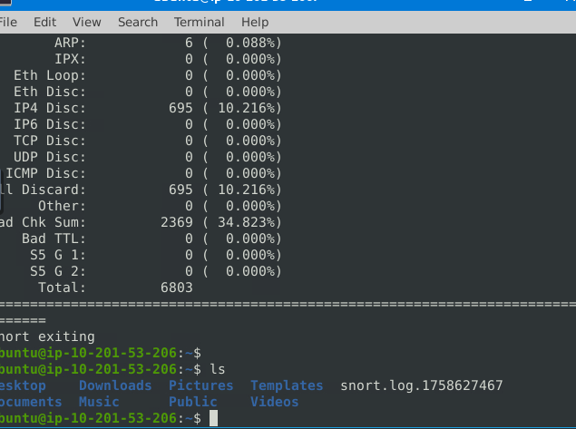
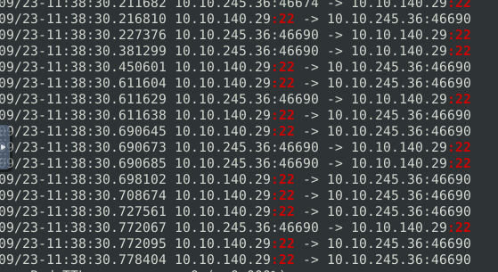
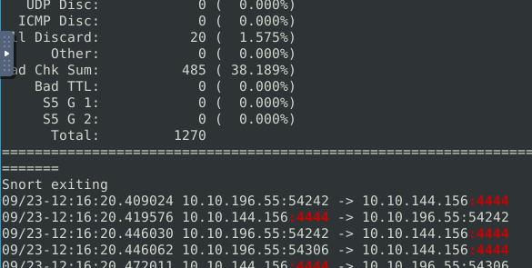

# 🧠 Snort Intrusion Detection and Prevention Lab  

## 🔹 Introduction  
In this lab, we used **Snort**, an open-source **Network Intrusion Detection and Prevention System (IDS/IPS)**, to detect and prevent real-time network threats.  

We’ll explore two scenarios:  
1. 🚨 **Brute Force Attack Detection & Mitigation**  
2. 🕵️ **Outbound Reverse Shell Detection**

---

## ⚔️ Scenario 1 — Detecting and Stopping a Brute Force Attack  

### 🧩 Situation  
A brute-force attack was detected targeting the company’s SSH service.  
As the cybersecurity specialist, your task is to **analyze Snort traffic logs**, identify the anomaly, and **create a rule to stop the attack**.

---

### 🔍 Step 1: Observe the Network Traffic  

Run Snort to capture live packets:  

```bash
sudo snort -dev -l .

📸 Screenshot:
<p align="center">  </p>

After capturing the packets, press Ctrl + C to stop the process.
🗂️ Step 2: Check and Read the Log File

List the directory to confirm the log file was generated:

ls

Then analyze the captured log:

sudo snort -r snort.log.1758627467

Upon inspection, a suspicious repeated connection to port 22 (SSH) was observed:

10.10.140.29:22 -> 10.10.245.36:46610

This pattern indicates a potential brute-force attack targeting SSH.
🔎 Step 3: Filter SSH Traffic for Confirmation

Filter logs referencing port 22 to confirm repetitive SSH access attempts:

sudo snort -r snort.log.1758627467 | grep ":22"

📸 Screenshot:
<p align="center">  </p>

The red-marked area highlights multiple connection attempts on port 22, confirming a brute-force attack.
🛡️ Step 4: Add a Snort Rule to Block the Attack

Open Snort’s local rules file to add a blocking rule:

sudo mousepad /etc/snort/rules/local.rules

Add the following rule:

drop tcp any any <> any 22 (msg:"SSH Brute Force Attack Prevented - Packet Dropped"; sid:100001; rev:1)

💡 Explanation:

    drop → Drops matching packets

    tcp any any <> any 22 → Matches TCP traffic to port 22

    msg → Displays a custom alert message

    sid → Unique Snort rule ID

    rev → Revision number

✅ Step 5: Run Snort in Inline Mode to Enforce the Rule

Finally, run Snort in inline mode for active blocking:

sudo snort -Q --daq afpacket -i eth0:eth1 -dev -c /etc/snort/snort.conf -A full -l .

Snort now actively drops any malicious SSH brute-force attempts detected on port 22.
🧰 Scenario 2 — Detecting Outbound Reverse Shell Connections
🧩 Situation

The team suspects outbound traffic anomalies, possibly indicating a reverse shell.
We’ll capture and analyze the traffic, then create a rule to block it.
🔍 Step 1: Capture Outbound Traffic

Run Snort to start capturing packets:

sudo snort -dev -l .

After a short capture period, stop Snort with Ctrl + C.
🔎 Step 2: Analyze the Captured Logs

Filter packets using port 4444, a common reverse shell port:

sudo snort -r snort.log.1758629770 | grep ":4444"

📸 Screenshot:
<p align="center">  </p>

Here, port 4444 is actively used — confirming potential reverse shell activity.
🛡️ Step 3: Add a Rule to Block the Reverse Shell

Open the Snort rules file again:

sudo mousepad /etc/snort/rules/local.rules

Add this rule:

reject tcp any 4444 <> any any (msg:"Reverse Shell Prevented - Packet Dropped"; sid:100002; rev:1)

💡 Explanation:

    reject → Blocks and sends a TCP reset

    tcp any 4444 <> any any → Detects TCP traffic using port 4444

    msg → Displays prevention message

    sid → Unique Snort rule ID

    rev → Rule version

✅ Step 4: Enforce the Rule

Run Snort in inline mode to apply the new rule:

sudo snort -Q --daq afpacket -i eth0:eth1 -dev -c /etc/snort/snort.conf -A full -l .

Snort now automatically detects and drops reverse shell connections on port 4444.
🧾 Summary
Scenario	Threat Type	Port	Action	Status
1	SSH Brute Force	22	Dropped	✅ Prevented
2	Reverse Shell	4444	Rejected	✅ Prevented
🧩 Conclusion

Through both scenarios, we demonstrated:

    Real-time detection of network anomalies using Snort

    Writing custom rules to block specific attack patterns

    Using inline mode to actively prevent malicious packets

Snort remains a powerful open-source IDS/IPS capable of defending against a wide range of cyberattacks when properly configured.

