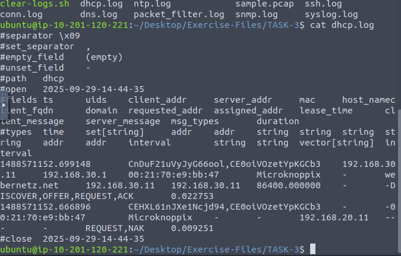

# 🕵️‍♂️ Zeek (formerly Bro) – Network Monitoring and Analysis Lab  

## 🔹 Introduction  
**Zeek** (formerly **Bro**) is an open-source and commercial **passive network monitoring tool** developed by **Lawrence Berkeley Labs**.  
Unlike traditional IDS/IPS tools, Zeek focuses on providing **comprehensive, structured logs** for **forensic investigation**, **threat hunting**, and **network behavior analysis**.  

Zeek can generate **50+ types of logs** across **7 categories**, covering a wide range of network activities such as **DNS**, **HTTP**, **SSL**, and **connection tracking**.

---

## 🔹 Zeek Command Line Overview  

| **Parameter** | **Description** |
|---------------|----------------|
| `-r` | Read and process a `.pcap` file. |
| `-C` | Ignore checksum errors. |
| `-v` | Show version information. |
| `zeekctl` | Manage Zeek processes and configurations (ZeekControl module). |

---

## 🔹 Useful Linux Commands for Zeek Analysis  

### 🧱 Basics

| **Command** | **Description** |
|--------------|----------------|
| `history` | View command history. |
| `!10` | Execute the 10th command from history. |
| `!!` | Execute the previous command again. |

---

### 📂 Reading Files

| **Command** | **Description** |
|--------------|----------------|
| `cat sample.txt` | Display file contents. |
| `head sample.txt` | Display the first 10 lines of a file. |
| `tail sample.txt` | Display the last 10 lines of a file. |

---

### 🔍 Searching & Filtering

| **Command** | **Description** |
|--------------|----------------|
| `cat test.txt \| cut -f 1` | Cut the first field (tab-delimited). |
| `cat test.txt \| cut -c1` | Cut the first character. |
| `cat test.txt \| grep 'keyword'` | Filter lines containing a keyword. |
| `cat test.txt \| sort` | Sort lines alphabetically. |
| `cat test.txt \| sort -n` | Sort lines numerically. |
| `cat test.txt \| uniq` | Remove duplicate lines. |
| `cat test.txt \| wc -l` | Count the number of lines. |
| `cat test.txt \| nl` | Add line numbers to each line. |

---

### ⚙️ Advanced Text Processing

| **Command** | **Description** |
|--------------|----------------|
| `cat test.txt \| sed -n '11p'` | Print line 11. |
| `cat test.txt \| sed -n '10,15p'` | Print lines 10–15. |
| `cat test.txt \| awk 'NR < 11 {print $0}'` | Print lines below line 11. |
| `cat test.txt \| awk 'NR == 11 {print $0}'` | Print only line 11. |

---

### 📊 Zeek-Specific Operations

| **Command** | **Description** |
|--------------|----------------|
| `cat signatures.log \| zeek-cut uid src_addr dst_addr` | Extract specific fields from Zeek logs. |

---

## 🔹 Common Log Analysis Use Cases  

| **Command / Combination** | **Description** |
|----------------------------|----------------|
| `sort \| uniq` | Remove duplicate values. |
| `sort \| uniq -c` | Count occurrences of unique values. |
| `sort -nr` | Sort numerically in reverse order. |
| `rev` | Reverse string characters. |
| `cut -f 1` | Cut the first field. |
| `cut -d '.' -f 1-2` | Split a string by dots and keep the first two parts. |
| `grep -v 'test'` | Exclude lines containing “test”. |
| `grep -v -e 'test1' -e 'test2'` | Exclude multiple keywords. |
| `file` | Display file type information. |
| `grep -rin 'Testvalue1' * \| column -t \| less -S` | Recursively search for a string, format columns, and paginate the output. |

---

## 🔹 Zeek DNS Tunneling Investigation  

📸 **Screenshot:**  


---

### 🧩 Scenario Overview  
In this case study, Zeek triggered an alert:  
> **“Anomalous DNS Activity Detected.”**

The incident was assigned to an analyst to determine if it was a **true positive** by inspecting the **PCAP** and **Zeek DNS logs**.

---

### 🧭 Investigation Steps  

1. **Navigate to the working directory:**
   ```bash
   ubuntu@ip-10-201-20-104:~/Desktop/Exercise-Files/anomalous-dns$ ls -al

Files available for analysis:

dns-tunneling.pcap
dns.log
conn.log
weird.log

2. Process the PCAP file with Zeek:

zeek -r dns-tunneling.pcap

3. Inspect DNS logs for suspicious queries:

cat dns.log | zeek-cut id.orig_h id.resp_h query qtype_name

4. Count DNS records linked to IPv6 addresses:

    cat dns.log | zeek-cut id.resp_h | grep ':' | wc -l

    🧠 This command filters IPv6 addresses (those containing :) and counts them.

🔹 Result

After reviewing the DNS traffic, the analyst confirmed that multiple DNS requests were directed toward IPv6 addresses, exhibiting patterns of DNS tunneling behavior.
Thus, the alert “Anomalous DNS Activity” was verified as a True Positive.
🧩 Conclusion

Zeek’s structured logging and filtering capabilities make it a powerful tool for network forensics and threat analysis.
By combining Linux command-line utilities with Zeek’s native logs, analysts can efficiently:

    🔍 Extract suspicious indicators

    ✅ Verify anomaly alerts

    🧠 Detect potential data exfiltration methods such as DNS tunneling